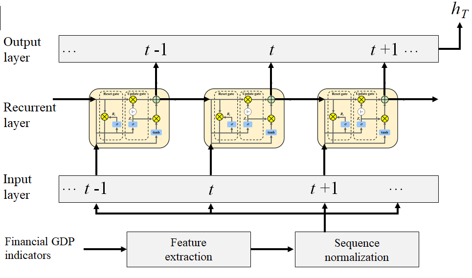

---
## Data Science
---
### Government Expenditure Predictions using Advanced Deep Learning.

In this project I use a government expenditure time-series dataset retrieved from the World Bank open data repository to forecast future government expenditure outcomes for individual economies. I compare model outcomes of 7 machine learning techniques such as Support vector regression (SVR), Convolution neural network (CNN), and Gated recurrent unit (GRU). 

 

 

---

© 2023 Tshimologo Molefyane Powered by Jekyll and the Minimal Theme.

